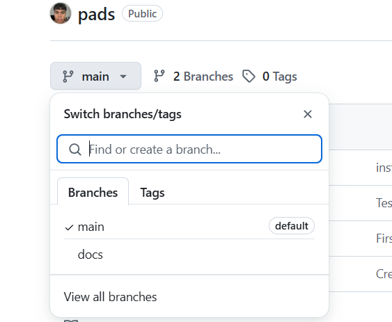
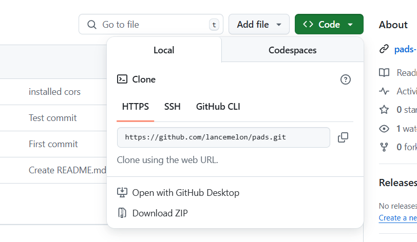
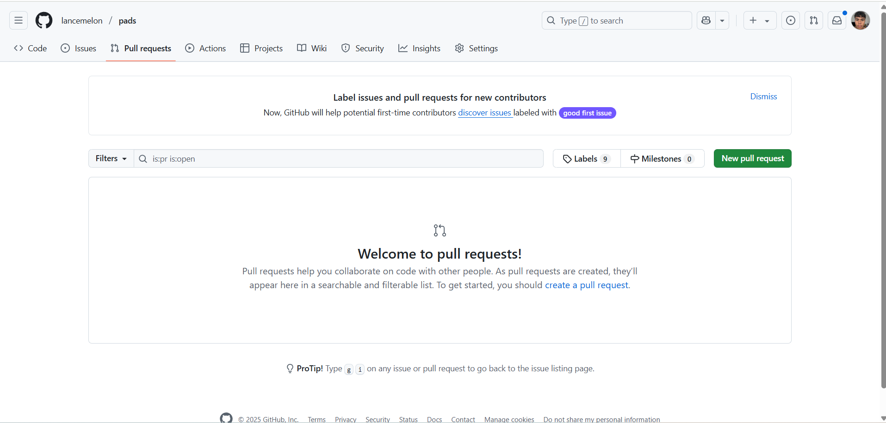
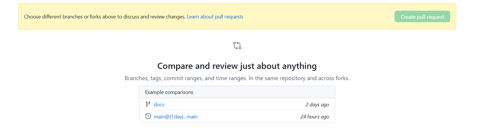

**Python and Data Science From Scratch Lab Supplemental Learning website.**

Link to website: https://pads-murex.vercel.app/

**Contribute**

Pre-Reqs:
* [Download GIT](https://git-scm.com/downloads)
* [Download Node.js](https://nodejs.org/en/download)
* [Create GitHub Account](https://github.com/)

Once installed [email me](mailto:ljp24@students.uwf.edu?subject=PADS%20Contribution&body=I%20want%20to%20help%20with%20the%20website.%20My%20username%20is:) me your GitHub username, or message me on [discord](https://discord.com/users/lancemelon) so I can add you as a contributer and create a branch.

**Cloning Repo:**
1) Confirm and navigate to your specified branch. 

2) Clone the repo onto your local coputer by clicking the green `Code` button, then copy the `HTTPS` link. In the terminal run the command `git clone YOUR_LINK`

3) Open the new file in your code editor and run `git checkout YOUR_BRANCH` in the terminal.

**Testing Changes:**
1) Navigate to the `frontend` directory project in your code editor terminal. Run the command `npm install` to install all dependencies.

2) In the `frontend` directory run the command `npm run dev`.

3) A local host link will appear and you can use this link to view changes in browser.

    * Modyfying Existing Content:
        1) Navigate to the `pyContent` folder. Follow: `frontend/src/assets/pyContent` 

        2) You can modify existing files in this folder.

    * Creating New Content:
        1) Navigate to the `pyLessons.json` file. Follow: `frontend/src/assets/pyLessons`

        2) Follow the provided structure of the file and add new content as needed.

        3) Navigate to the `pyContent` folder. Follow: `frontend/src/assets/pyContent`

        4) Create new json file and follow the structure of previous lessons.

4) Once finished testing `ctrl + c` in the terminal to end the process.

**Uploading Changes to Website:**
1) After testing push changes to your branch in GitHub.

    * Run commands in terminal (confirm you are in correct branch)
        1) `git add .`

        2) `git commit -m "ADD_DESCRIPTIVE_MESSAGE"`

        3) `git push`

2) On the GitHub website navigate to the `Pull Requests` tab. 

3) Click the green `New pull request` button, find click your specifc branch, and create new pull request. 

4) Others will review your changes and you can either merge your pull request into the main branch or you can implement changes based on reviews.